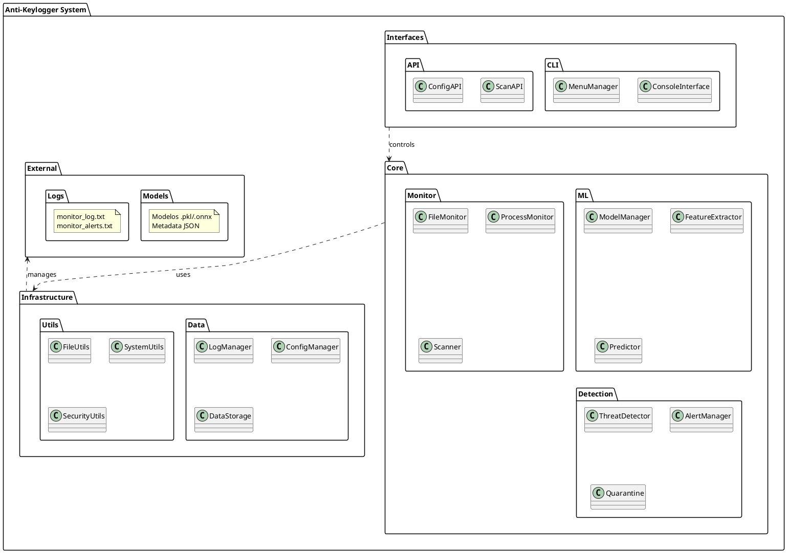
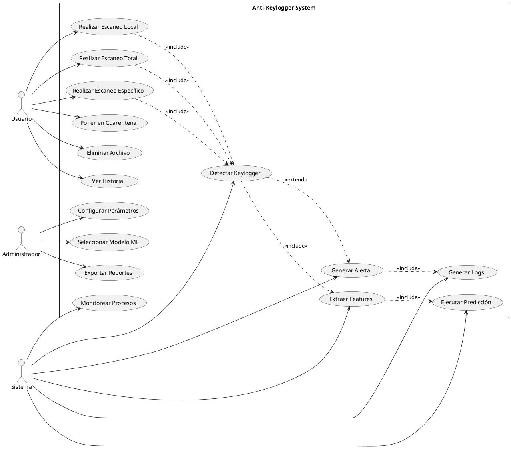
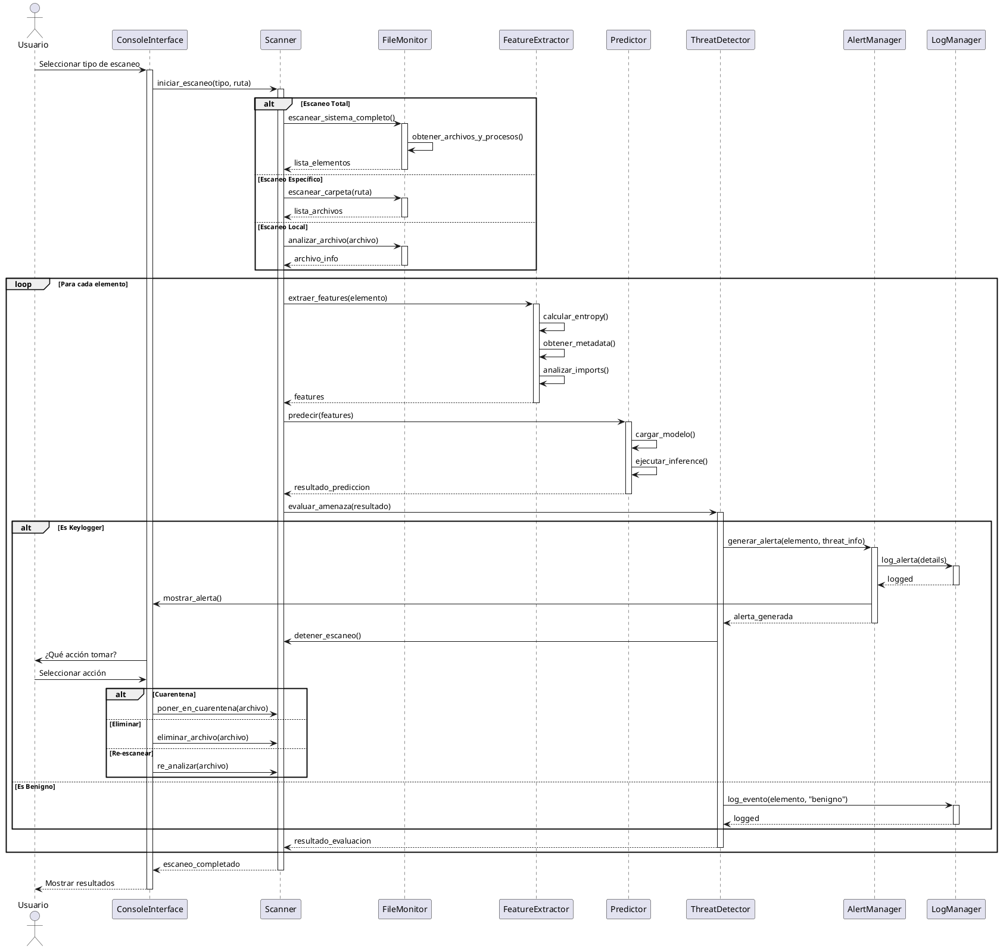
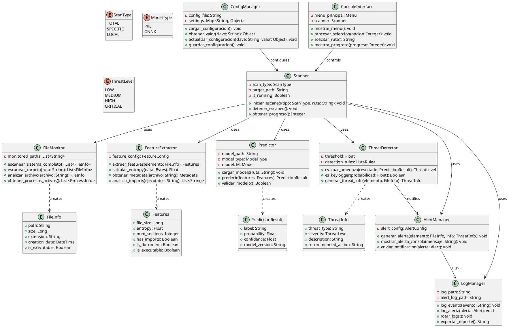
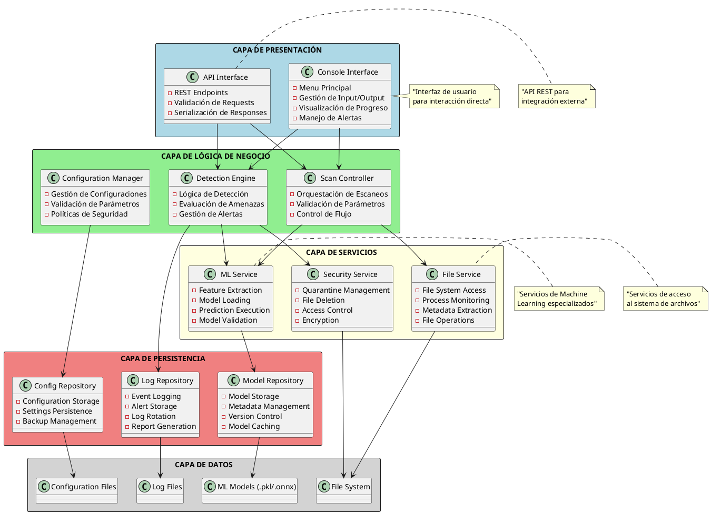

# Diagramas del Proyecto Anti-Keylogger

## Diagrama de Paquetes



## Diagrama de Casos de Uso



## Diagrama Secuencial



## Diagrama de Clases



## Diagrama de Arquitectura - Arquitectura por Capas



## Diagrama de Arquitectura - Arquitectura Hexagonal (Ports & Adapters)

```plantuml
@startuml
!allowmixing

skinparam rectangle {
    BackgroundColor<<core>> lightgreen
    BackgroundColor<<adapter>> lightblue
    BackgroundColor<<port>> lightyellow
}

rectangle "DOMINIO CENTRAL" <<core>> {
    rectangle "Anti-Keylogger Core" as Core {
        note "ScanService\nDetectionService\nMLService\nSecurityService" as CoreServices
    }
}

' Puertos (Interfaces)
rectangle "PUERTOS DE ENTRADA" <<port>> {
    interface IScanPort
    interface IConfigPort
    interface IAlertPort
}

rectangle "PUERTOS DE SALIDA" <<port>> {
    interface IFileSystemPort
    interface IMLModelPort
    interface ILogPort
    interface ISecurityPort
}

' Adaptadores de Entrada
rectangle "ADAPTADORES DE ENTRADA" <<adapter>> {
    rectangle "Console Adapter" as ConsoleAdapter
    rectangle "API Adapter" as APIAdapter
    rectangle "Scheduler Adapter" as SchedulerAdapter
}

' Adaptadores de Salida
rectangle "ADAPTADORES DE SALIDA" <<adapter>> {
    rectangle "File System Adapter" as FSAdapter
    rectangle "Scikit-Learn Adapter" as SKAdapter
    rectangle "ONNX Adapter" as ONNXAdapter
    rectangle "Text Log Adapter" as LogAdapter
    rectangle "Quarantine Adapter" as QuarantineAdapter
}

' Sistemas Externos
rectangle "SISTEMAS EXTERNOS" {
    database "File System" as FS
    database "ML Models" as Models
    database "Log Files" as LogFiles
    cloud "External APIs" as ExtAPI
}

' Relaciones
ConsoleAdapter ..> IScanPort
APIAdapter ..> IScanPort
SchedulerAdapter ..> IScanPort

ConsoleAdapter ..> IConfigPort
APIAdapter ..> IConfigPort

Core ..> IAlertPort

IScanPort <.. Core
IConfigPort <.. Core
IAlertPort <.. Core

Core ..> IFileSystemPort
Core ..> IMLModelPort
Core ..> ILogPort
Core ..> ISecurityPort

IFileSystemPort <.. FSAdapter
IMLModelPort <.. SKAdapter
IMLModelPort <.. ONNXAdapter
ILogPort <.. LogAdapter
ISecurityPort <.. QuarantineAdapter

FSAdapter --> FS
SKAdapter --> Models
ONNXAdapter --> Models
LogAdapter --> LogFiles
QuarantineAdapter --> FS

note top of Core : "Lógica de negocio\npura, independiente\nde tecnologías externas"

note bottom of ConsoleAdapter : "Interfaz de línea\nde comandos"

note bottom of FSAdapter : "Acceso directo al\nsistema de archivos"

@enduml
```

---

## Recomendación de Arquitectura

Para este proyecto, recomiendo la **Arquitectura por Capas** por las siguientes razones:

1. **Simplicidad:** Más fácil de entender e implementar para un prototipo
2. **Separación clara:** Cada capa tiene responsabilidades bien definidas
3. **Escalabilidad:** Permite agregar funcionalidades de forma ordenada
4. **Mantenibilidad:** Facilita la localización y corrección de errores
5. **Testabilidad:** Cada capa puede probarse independientemente

La Arquitectura Hexagonal sería ideal para versiones futuras cuando se requiera mayor flexibilidad de integración.